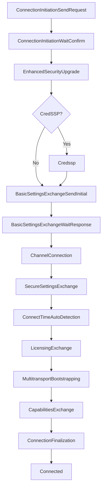

IronRDP implements the RDP connection and session lifecycle using explicit state machines that handle each protocol phase. This design provides precise control and testability without hidden I/O operations.

## State Machine Architecture

The connection process is split across two primary crates:

- **`ironrdp-connector`**: Handles connection establishment up to the "Connected" state
- **`ironrdp-session`**: Manages the active RDP session after connection

### Why State Machines?

IronRDP's state machine design enforces several architectural invariants:

1. **No hidden I/O**: Core tier crates never perform network operations
2. **Explicit state transitions**: Each step is visible and controllable
3. **Testability**: States can be tested in isolation
4. **Async-agnostic**: Works with blocking, async, or custom I/O strategies

```rust
pub trait Sequence: Send {
    fn next_pdu_hint(&self) -> Option<&dyn PduHint>;
    fn state(&self) -> &dyn State;
    fn step(&mut self, input: &[u8], output: &mut WriteBuf) -> ConnectorResult<Written>;
}
```

See `ironrdp-connector/src/lib.rs:327-337`.

## Connection States

The `ClientConnector` state machine progresses through these states:

### State Diagram



## Step-by-Step Connection Flow

<Steps>

### 1. Initialize Connector

Create a `ClientConnector` with your configuration:

```rust
use ironrdp_connector::{ClientConnector, Config, DesktopSize, Credentials};
use std::net::{SocketAddr, IpAddr, Ipv4Addr};

let config = Config {
    desktop_size: DesktopSize { width: 1920, height: 1080 },
    desktop_scale_factor: 100,
    enable_tls: true,
    enable_credssp: true,
    credentials: Credentials::UsernamePassword {
        username: "admin".to_string(),
        password: "P@ssw0rd".to_string(),
    },
    domain: Some("CORP".to_string()),
    client_build: 7601,
    client_name: "ironrdp-client".to_string(),
    // ... (other fields with defaults)
};

let client_addr = SocketAddr::new(IpAddr::V4(Ipv4Addr::new(192, 168, 1, 100)), 0);
let mut connector = ClientConnector::new(config, client_addr);
```

Initial state: `ConnectionInitiationSendRequest`

### 2. Connection Initiation

The connector sends an X.224 Connection Request:

```rust
use ironrdp_core::WriteBuf;
use ironrdp_connector::{Sequence, Written};

let mut output = WriteBuf::new();
let written = connector.step(&[], &mut output)?;

if let Written::Size(size) = written {
    let request_pdu = output.filled();
    // Send request_pdu to server via TCP socket
    stream.write_all(request_pdu)?;
}
```

**What happens internally:**

```rust
// ironrdp-connector/src/connection.rs:245-291
let mut security_protocol = nego::SecurityProtocol::empty();

if self.config.enable_tls {
    security_protocol.insert(nego::SecurityProtocol::SSL);
}

if self.config.enable_credssp {
    security_protocol.insert(
        nego::SecurityProtocol::HYBRID | nego::SecurityProtocol::HYBRID_EX
    );
}

let connection_request = nego::ConnectionRequest {
    nego_data: /* cookie or None */,
    flags: nego::RequestFlags::empty(),
    protocol: security_protocol,
};
```

State transitions to: `ConnectionInitiationWaitConfirm`

### 3. Receive Connection Confirm

Read the server's X.224 Connection Confirm:

```rust
let mut input_buf = vec![0u8; 4096];
let bytes_read = stream.read(&mut input_buf)?;
let input = &input_buf[..bytes_read];

let written = connector.step(input, &mut output)?;
```

**What happens internally:**

```rust
// ironrdp-connector/src/connection.rs:293-323
let connection_confirm = decode::<X224<nego::ConnectionConfirm>>(input)?;

let (flags, selected_protocol) = match connection_confirm {
    nego::ConnectionConfirm::Response { flags, protocol } => (flags, protocol),
    nego::ConnectionConfirm::Failure { code } => {
        return Err(/* NegotiationFailure error */);
    }
};

// Verify server selected a protocol we offered
if !selected_protocol.intersects(requested_protocol) {
    return Err(/* protocol mismatch error */);
}
```

State transitions to: `EnhancedSecurityUpgrade`

### 4. TLS Upgrade

When the state is `EnhancedSecurityUpgrade`, user code must perform the TLS handshake:

```rust
if connector.should_perform_security_upgrade() {
    // Perform TLS handshake on the TCP stream
    let tls_stream = tls_connector.connect(server_name, stream)?;
    
    // Mark upgrade as complete
    connector.mark_security_upgrade_as_done();
    
    // Update stream reference
    stream = tls_stream;
}
```

IronRDP doesn't perform I/O, so TLS setup is the application's responsibility. You can use:
- `rustls` with `tokio-rustls` or `async-rustls`
- `native-tls`
- Any TLS implementation

See `crates/ironrdp-tls` for TLS boilerplate helpers.

State transitions to: `Credssp` or `BasicSettingsExchangeSendInitial`

### 5. CredSSP Authentication (NLA)

If CredSSP is negotiated:

```rust
if connector.should_perform_credssp() {
    // Perform CredSSP authentication using the sspi crate
    // This is also handled by user code
    perform_credssp_auth(&mut stream, &config.credentials)?;
    
    connector.mark_credssp_as_done();
}
```

IronRDP exposes `sspi` re-exports but leaves CredSSP execution to user code. See `ironrdp-connector/src/credssp.rs` for reference.

State transitions to: `BasicSettingsExchangeSendInitial`

### 6. Basic Settings Exchange

Client sends MCS Connect-Initial with GCC blocks:

```rust
let written = connector.step(&[], &mut output)?;
if let Written::Size(_) = written {
    stream.write_all(output.filled())?;
}
```

**GCC blocks sent:**
- `ClientCoreData`: Desktop size, color depth, keyboard layout, client name, RDP version
- `ClientSecurityData`: Encryption methods (empty for Enhanced RDP Security)
- `ClientNetworkData`: List of static virtual channels to open

```rust
// ironrdp-connector/src/connection.rs:668-728
ClientGccBlocks {
    core: ClientCoreData {
        version: RdpVersion::V5_PLUS,
        desktop_width: config.desktop_size.width,
        desktop_height: config.desktop_size.height,
        keyboard_layout: config.keyboard_layout,
        client_name: config.client_name.clone(),
        optional_data: ClientCoreOptionalData {
            supported_color_depths: Some(supported_color_depths),
            early_capability_flags: Some(early_capability_flags),
            server_selected_protocol: Some(selected_protocol),
            // ...
        },
    },
    security: ClientSecurityData { /* ... */ },
    network: Some(ClientNetworkData { channels }),
    // ...
}
```

State transitions to: `BasicSettingsExchangeWaitResponse`

Server responds with MCS Connect-Response containing:
- `ServerCoreData`: RDP version, early capability flags
- `ServerSecurityData`: Server random, certificates (if applicable)
- `ServerNetworkData`: Assigned MCS channel IDs for static channels

```rust
output.clear();
let bytes_read = stream.read(&mut input_buf)?;
let written = connector.step(&input_buf[..bytes_read], &mut output)?;
```

The connector maps client static channels to their assigned server channel IDs:

```rust
// ironrdp-connector/src/connection.rs:401-409
let zipped: Vec<_> = self
    .static_channels
    .type_ids()
    .zip(static_channel_ids.iter().copied())
    .collect();

zipped.into_iter().for_each(|(channel, channel_id)| {
    self.static_channels.attach_channel_id(channel, channel_id);
});
```

State transitions to: `ChannelConnection`

### 7. Channel Connection

Join each static channel using MCS Channel Join Request/Confirm:

```rust
while !matches!(connector.state(), ClientConnectorState::SecureSettingsExchange { .. }) {
    output.clear();
    let written = connector.step(&[], &mut output)?;
    
    if let Written::Size(_) = written {
        stream.write_all(output.filled())?;
        let bytes_read = stream.read(&mut input_buf)?;
        connector.step(&input_buf[..bytes_read], &mut output)?;
    }
}
```

This step can be skipped if the server advertises `ServerEarlyCapabilityFlags::SKIP_CHANNELJOIN_SUPPORTED`.

State transitions to: `SecureSettingsExchange`

### 8. Secure Settings Exchange

Client sends Client Info PDU with credentials and settings:

```rust
// ironrdp-connector/src/connection.rs:741-815
let client_info = ClientInfo {
    credentials: Credentials {
        username: config.credentials.username().unwrap_or("").to_owned(),
        password: config.credentials.secret().to_owned(),
        domain: config.domain.clone(),
    },
    flags: flags,  // Includes COMPRESSION if compression_type is set
    compression_type: config.compression_type.unwrap_or(CompressionType::K8),
    alternate_shell: config.alternate_shell.clone(),
    work_dir: config.work_dir.clone(),
    extra_info: ExtendedClientInfo {
        address: client_addr.ip().to_string(),
        dir: config.client_dir.clone(),
        optional_data: ExtendedClientOptionalInfo::builder()
            .timezone(config.timezone_info.clone())
            .performance_flags(config.performance_flags)
            .build(),
    },
};
```

State transitions through: `ConnectTimeAutoDetection` → `LicensingExchange` → `MultitransportBootstrapping`

### 9. Licensing Exchange

Server sends license information. Client may respond with cached license data:

```rust
let license_exchange = LicenseExchangeSequence::new(
    io_channel_id,
    username.to_owned(),
    domain.clone(),
    hardware_id,
    license_cache,  // Arc<dyn LicenseCache>
);
```

Implement `LicenseCache` trait to persist licenses:

```rust
pub trait LicenseCache: Send + Sync {
    fn get(&self, server_name: &str) -> Option<Vec<u8>>;
    fn store(&self, server_name: &str, license: Vec<u8>);
}
```

See `ironrdp-connector/src/license_exchange.rs`.

### 10. Capabilities Exchange

Server sends Demand Active PDU with capability sets. Client responds with Confirm Active PDU:

```rust
loop {
    output.clear();
    let bytes_read = stream.read(&mut input_buf)?;
    let written = connector.step(&input_buf[..bytes_read], &mut output)?;
    
    if let Written::Size(_) = written {
        stream.write_all(output.filled())?;
    }
    
    if connector.state().is_terminal() {
        break;
    }
}
```

Capability sets negotiated:
- General, Bitmap, Order, Pointer, Input
- Virtual Channel, Sound, Surface Commands
- Offscreen Bitmap Cache, Glyph Cache

State transitions to: `ConnectionFinalization`

### 11. Connection Finalization

Final PDU exchange:
- Synchronize PDU
- Control Cooperate PDU  
- Control Granted Control PDU
- Font Map PDU

State transitions to: `Connected`

### 12. Extract Connection Result

Once connected, extract the `ConnectionResult`:

```rust
use ironrdp_connector::{ClientConnectorState, ConnectionResult};

let result = match connector.state {
    ClientConnectorState::Connected { result } => result,
    _ => panic!("Expected Connected state"),
};

let ConnectionResult {
    io_channel_id,
    user_channel_id,
    share_id,
    static_channels,
    desktop_size,
    connection_activation,
    compression_type,
    ..  
} = result;
```

</Steps>

## Active Session Management

After connection, use `ironrdp-session::ActiveStage` to handle the active session:

```rust
use ironrdp_session::{ActiveStage, ActiveStageOutput};

let mut session = connection_activation.into_active_stage();

loop {
    let mut buf = vec![0u8; 8192];
    let bytes_read = stream.read(&mut buf)?;
    
    match session.process(&buf[..bytes_read], &mut output)? {
        ActiveStageOutput::GraphicsUpdate(update) => {
            // Render graphics update
        }
        ActiveStageOutput::PointerUpdate(pointer) => {
            // Update mouse pointer
        }
        ActiveStageOutput::Terminated(reason) => {
            // Handle disconnection
            break;
        }
        // ... other output types
    }
    
    if output.filled_len() > 0 {
        stream.write_all(output.filled())?;
        output.clear();
    }
}
```

See `ironrdp-session/src/active_stage.rs` for the complete `ActiveStageOutput` enum.

## Adding Static Virtual Channels

Register static channels before stepping through the connector:

```rust
use ironrdp_svc::{SvcClientProcessor, SvcMessage};
use ironrdp_cliprdr::CliprdrClient;

let cliprdr = CliprdrClient::new();
let connector = ClientConnector::new(config, client_addr)
    .with_static_channel(cliprdr);
```

Channels must implement `SvcClientProcessor`:

```rust
pub trait SvcClientProcessor: SvcProcessor {}

pub trait SvcProcessor: AsAny + fmt::Debug + Send {
    fn channel_name(&self) -> ChannelName;
    fn start(&mut self) -> PduResult<Vec<SvcMessage>>;
    fn process(&mut self, payload: &[u8]) -> PduResult<Vec<SvcMessage>>;
}
```

See [Virtual Channels](/concepts/virtual-channels) for details.

## Error Handling

The connector returns `ConnectorResult<T>` for all operations:

```rust
pub type ConnectorResult<T> = Result<T, ConnectorError>;

pub enum ConnectorErrorKind {
    Encode(EncodeError),
    Decode(DecodeError),
    Credssp(sspi::Error),
    Reason(String),
    AccessDenied,
    Negotiation(NegotiationFailure),
    // ...
}
```

Negotiation failures provide user-friendly messages:

```rust
match error.kind() {
    ConnectorErrorKind::Negotiation(failure) => {
        eprintln!("Connection failed: {}", failure);
        // "server requires Enhanced RDP Security with CredSSP"
    }
    // ...
}
```

See `ironrdp-connector/src/lib.rs:35-82` for `NegotiationFailure` definitions.

## Best Practices

<Note>
**Do:**
- Check `connector.state().is_terminal()` to know when connection is complete
- Use `connector.next_pdu_hint()` to determine expected PDU size for buffer allocation
- Clear `WriteBuf` between steps to avoid accumulating data
- Handle all `ConnectorError` variants appropriately

**Don't:**
- Call `step()` when in a terminal state
- Reuse the same input buffer without clearing between reads
- Assume specific byte sizes — always check `Written` result
- Skip security upgrade or CredSSP steps when indicated by state
</Note>

## Example: Complete Connection Loop

```rust
use ironrdp_connector::{ClientConnector, Sequence, Written};
use ironrdp_core::WriteBuf;

let mut connector = ClientConnector::new(config, client_addr);
let mut output = WriteBuf::new();
let mut input_buf = vec![0u8; 8192];

loop {
    // Check for external I/O requirements
    if connector.should_perform_security_upgrade() {
        stream = perform_tls_upgrade(stream)?;
        connector.mark_security_upgrade_as_done();
        continue;
    }
    
    if connector.should_perform_credssp() {
        perform_credssp(&mut stream, &config)?;
        connector.mark_credssp_as_done();
        continue;
    }
    
    // Step the state machine
    output.clear();
    let written = connector.step(&[], &mut output)?;
    
    // Send output if any
    if let Written::Size(_) = written {
        stream.write_all(output.filled())?;
    }
    
    // Check if we're done
    if connector.state().is_terminal() {
        break;
    }
    
    // Read response
    let bytes_read = stream.read(&mut input_buf)?;
    connector.step(&input_buf[..bytes_read], &mut output)?;
}

// Extract result
let result = match connector.state {
    ClientConnectorState::Connected { result } => result,
    _ => unreachable!(),
};
```

## References

- **State Machine Trait**: `ironrdp-connector/src/lib.rs:327-337`
- **Connector Implementation**: `ironrdp-connector/src/connection.rs`
- **Channel Connection**: `ironrdp-connector/src/channel_connection.rs`
- **License Exchange**: `ironrdp-connector/src/license_exchange.rs`
- **Connection Activation**: `ironrdp-connector/src/connection_activation.rs`
- **Active Session**: `ironrdp-session/src/active_stage.rs`